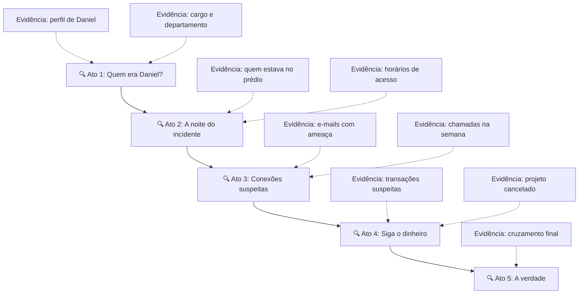
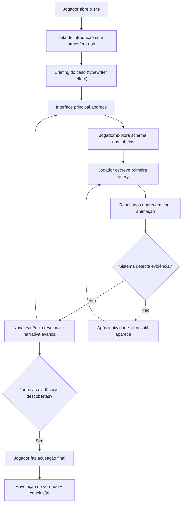

# 🔍 SQL Noir — Jogo Investigativo com SQL

Um jogo de investigação criminal no navegador onde o jogador resolve um caso usando consultas SQL como ferramenta de descoberta.

---

## Visão Geral

O jogador é um **analista forense digital** chamado para investigar uma morte suspeita dentro de uma empresa de tecnologia. Ele recebe acesso ao banco de dados corporativo e precisa cruzar informações — registros de acesso, chamadas, e-mails, transações — para reconstruir os eventos e identificar o responsável.

**Tudo roda no navegador.** Sem backend, sem instalação. O banco SQLite roda via WebAssembly (SQL.js).

---

## User Review Required

> [!IMPORTANT]
> **Idioma da interface**: O plano assume que a narrativa e a interface serão em **português brasileiro**. Confirmar se isso está correto ou se deve ser bilíngue.

> [!IMPORTANT]  
> **Complexidade do caso**: O plano propõe um caso com **6 tabelas** e uma narrativa com **5 atos de descoberta**. Isso é suficiente para o MVP ou prefere algo mais enxuto (3-4 tabelas, 3 atos)?

> [!IMPORTANT]
> **Nome do projeto**: Estou usando "SQL Noir" como nome de trabalho. Se tiver outro nome em mente, me avise.

---

## Open Questions

> [!NOTE]
> **Tom narrativo**: Estou planejando um tom **noir/suspense** (cores escuras, tipografia densa, atmosfera de tensão). Isso está alinhado com a visão? Ou prefere algo mais leve (ex: detetive amador, estilo cozy mystery)?

> [!NOTE]
> **Dificuldade SQL**: O caso deve exigir apenas `SELECT`, `WHERE`, `ORDER BY`, `JOIN`? Ou pode incluir `GROUP BY`, `HAVING`, subqueries? Isso impacta o design do caso.

---

## Arquitetura Técnica

```
┌─────────────────────────────────────────────┐
│              NAVEGADOR (100% client-side)    │
│                                             │
│  ┌──────────┐  ┌──────────┐  ┌───────────┐ │
│  │ Narrativa│  │ Terminal  │  │ Evidências│ │
│  │  Panel   │  │   SQL     │  │   Board   │ │
│  └──────────┘  └────┬─────┘  └───────────┘ │
│                     │                       │
│              ┌──────▼──────┐                │
│              │   SQL.js    │                │
│              │  (SQLite    │                │
│              │   WASM)     │                │
│              └──────┬──────┘                │
│                     │                       │
│              ┌──────▼──────┐                │
│              │  Database   │                │
│              │  (in-memory)│                │
│              └─────────────┘                │
└─────────────────────────────────────────────┘
```

### Stack
| Camada | Tecnologia | Justificativa |
|--------|-----------|---------------|
| Estrutura | HTML5 semântico | Simplicidade, SEO básico |
| Estilo | CSS vanilla (custom properties) | Controle total do tema noir |
| Lógica | JavaScript vanilla (ES modules) | Zero dependências de framework |
| Banco de dados | SQL.js (SQLite via WASM) | SQL real no browser, sem backend |
| Tipografia | Google Fonts (JetBrains Mono + Inter) | Terminal + legibilidade |

### Estrutura de Arquivos
```
APRENDER_BD/
├── index.html              # Página única do jogo
├── css/
│   ├── reset.css           # Reset/normalize
│   ├── variables.css       # Design tokens (cores, fontes, espaçamentos)
│   ├── layout.css          # Grid principal e responsividade
│   ├── terminal.css        # Estilo do editor SQL
│   ├── narrative.css       # Painel de narrativa
│   ├── evidence.css        # Board de evidências
│   └── animations.css      # Transições e micro-animações
├── js/
│   ├── main.js             # Entrada principal, inicialização
│   ├── database.js         # Carregamento SQL.js + criação do banco
│   ├── schema.js           # Definição das tabelas e dados do caso
│   ├── terminal.js         # Editor SQL + execução de queries
│   ├── narrative.js        # Motor de narrativa (avanço do caso)
│   ├── evidence.js         # Detecção de evidências + board visual
│   ├── feedback.js         # Mensagens de erro amigáveis + dicas
│   └── sound.js            # Efeitos sonoros sutis (opcional)
├── assets/
│   └── (imagens geradas)
└── lib/
    └── sql-wasm.js         # SQL.js library (CDN ou local)
```

---

## O Caso: "O Último Commit"

### Sinopse
> *Daniel Moreira, engenheiro sênior da Nexus Systems, foi encontrado morto em sua estação de trabalho na madrugada de uma sexta-feira. A polícia descartou crime, mas a seguradora da empresa contratou você — um analista forense digital — para investigar. Você tem acesso total ao banco de dados corporativo. Descubra o que realmente aconteceu.*

### Estrutura do Banco de Dados (6 tabelas)

#### `funcionarios`
| Coluna | Tipo | Descrição |
|--------|------|-----------|
| id | INTEGER | PK |
| nome | TEXT | Nome completo |
| cargo | TEXT | Cargo na empresa |
| departamento | TEXT | Departamento |
| data_admissao | DATE | Data de contratação |
| salario | REAL | Salário mensal |
| supervisor_id | INTEGER | FK → funcionarios.id |
| status | TEXT | ativo / desligado / afastado |

#### `registros_acesso`
| Coluna | Tipo | Descrição |
|--------|------|-----------|
| id | INTEGER | PK |
| funcionario_id | INTEGER | FK → funcionarios.id |
| local | TEXT | Sala / andar / área |
| data_hora | DATETIME | Timestamp do acesso |
| tipo | TEXT | entrada / saída |

#### `emails`
| Coluna | Tipo | Descrição |
|--------|------|-----------|
| id | INTEGER | PK |
| remetente_id | INTEGER | FK → funcionarios.id |
| destinatario_id | INTEGER | FK → funcionarios.id |
| assunto | TEXT | Assunto do e-mail |
| conteudo | TEXT | Corpo da mensagem |
| data_hora | DATETIME | Quando foi enviado |

#### `chamadas`
| Coluna | Tipo | Descrição |
|--------|------|-----------|
| id | INTEGER | PK |
| origem_id | INTEGER | FK → funcionarios.id |
| destino_id | INTEGER | FK → funcionarios.id |
| duracao_segundos | INTEGER | Duração |
| data_hora | DATETIME | Timestamp |

#### `transacoes`
| Coluna | Tipo | Descrição |
|--------|------|-----------|
| id | INTEGER | PK |
| funcionario_id | INTEGER | FK → funcionarios.id |
| tipo | TEXT | transferência / pagamento / reembolso |
| valor | REAL | Valor em R$ |
| descricao | TEXT | Detalhes |
| data | DATE | Data da transação |

#### `projetos`
| Coluna | Tipo | Descrição |
|--------|------|-----------|
| id | INTEGER | PK |
| nome | TEXT | Nome do projeto |
| responsavel_id | INTEGER | FK → funcionarios.id |
| orcamento | REAL | Orçamento alocado |
| status | TEXT | ativo / cancelado / concluído |
| data_inicio | DATE | Início |
| data_fim | DATE | Fim previsto |

### Arco Narrativo (5 Atos)

O caso se desenrola através de **evidências-chave**. Cada evidência é detectada automaticamente quando o jogador executa uma query que revela determinada informação.



| Ato | Gatilho (o que a query deve revelar) | Narrativa desbloqueada |
|-----|--------------------------------------|----------------------|
| 1 | Consultar dados de Daniel Moreira | "Daniel era engenheiro sênior... trabalhava no projeto Helix..." |
| 2 | Consultar registros de acesso da noite do incidente | "Três pessoas estavam no prédio àquela hora..." |
| 3 | Consultar e-mails ou chamadas entre suspeitos | "Um e-mail enviado 2 dias antes dizia: 'Isso não vai ficar assim'..." |
| 4 | Consultar transações financeiras irregulares | "R$ 87.000 foram transferidos para uma conta pessoal..." |
| 5 | Cruzar suspeito + local + horário + motivo | "Tudo aponta para uma pessoa. Você tem certeza?" |

### Sistema de Detecção de Evidências

O sistema **não compara queries literais**. Em vez disso, ele analisa os **resultados retornados**:

```javascript
// Pseudocódigo do detector
function checkEvidence(queryResults, columns) {
  // Ato 1: Jogador consultou dados do Daniel?
  if (resultsContainRow(results, { nome: 'Daniel Moreira' })) {
    unlockEvidence('perfil_daniel');
  }
  
  // Ato 2: Jogador viu registros da noite?
  if (resultsContainDate(results, '2025-03-14') && columns.includes('local')) {
    unlockEvidence('acesso_noturno');
  }
  
  // etc...
}
```

Isso significa que o jogador pode chegar à evidência por **qualquer caminho SQL válido** — não existe "query certa".

---

## Design da Interface

### Layout Principal (3 painéis)

```
┌─────────────────────────────────────────────────┐
│  ░░ SQL NOIR ░░                    [Evidências] │  ← Header
├──────────────────┬──────────────────────────────┤
│                  │                              │
│    NARRATIVA     │        TERMINAL SQL          │
│                  │                              │
│  Texto do caso   │  > SELECT * FROM ...         │
│  com typewriter  │  ┌──────────────────────┐    │
│  effect          │  │  Resultados em       │    │
│                  │  │  tabela estilizada    │    │
│  Evidências      │  │                      │    │
│  descobertas     │  └──────────────────────┘    │
│  aparecem aqui   │                              │
│                  │                              │
├──────────────────┴──────────────────────────────┤
│  Schema Explorer: funcionarios | emails | ...   │  ← Footer
└─────────────────────────────────────────────────┘
```

### Estética Visual

| Elemento | Estilo |
|----------|--------|
| Fundo | Gradiente escuro (#0a0a0f → #1a1a2e) |
| Acentos | Âmbar/dourado (#f0c040) — remetendo a lâmpadas de escritório |
| Terminal | Fundo quase-preto com texto verde-âmbar, estilo retro-moderno |
| Narrativa | Tipografia serifada, efeito typewriter, fundo com textura de papel |
| Evidências | Cards com borda brilhante, animação de "reveal" ao desbloquear |
| Tabelas de resultado | Linhas alternadas, highlight ao hover, transição suave |
| Erros SQL | Mensagens amigáveis em tom investigativo, nunca técnico |

### Mensagens de Erro (tom investigativo)

| Erro real | Mensagem exibida |
|-----------|-----------------|
| `no such table` | "📁 Essa fonte de dados não existe no sistema. Verifique os arquivos disponíveis abaixo." |
| `syntax error` | "⚡ O sistema não entendeu o comando. Tente reformular sua consulta." |
| `no such column` | "🔍 Esse campo não foi encontrado. Explore a estrutura das tabelas para ver os campos disponíveis." |
| Resultado vazio | "📭 Nenhum registro encontrado. Talvez os filtros estejam muito restritivos. Tente ampliar a busca." |

### Micro-animações

- **Typewriter** na narrativa (texto aparece letra por letra)
- **Glow pulse** nos botões e bordas ativas
- **Slide-in** dos resultados de query
- **Reveal + shake** ao descobrir uma evidência
- **Ambient particles** sutis no background (efeito "poeira digital")
- **Cursor piscando** no terminal estilo retrô

---

## Fluxo do Jogador



---

## Proposed Changes

### 1. Foundation (HTML + CSS Design System)

#### [NEW] [index.html](file:///c:/Users/User/Documents/APRENDER_BD/index.html)
- Estrutura HTML semântica com os 3 painéis
- Meta tags SEO
- Carregamento do SQL.js via CDN
- Loading screen com atmosfera

#### [NEW] [css/variables.css](file:///c:/Users/User/Documents/APRENDER_BD/css/variables.css)
- Design tokens: cores noir, tipografia, espaçamentos, sombras
- Tema completo com CSS custom properties

#### [NEW] [css/reset.css](file:///c:/Users/User/Documents/APRENDER_BD/css/reset.css)
- Reset CSS moderno

#### [NEW] [css/layout.css](file:///c:/Users/User/Documents/APRENDER_BD/css/layout.css)
- Grid principal responsivo (3 painéis)
- Breakpoints mobile/tablet

#### [NEW] [css/terminal.css](file:///c:/Users/User/Documents/APRENDER_BD/css/terminal.css)
- Estilo do editor SQL (fundo escuro, fonte mono, cursor piscante)
- Tabela de resultados estilizada

#### [NEW] [css/narrative.css](file:///c:/Users/User/Documents/APRENDER_BD/css/narrative.css)
- Painel de narrativa (efeito papel, tipografia serifada)
- Cards de evidência

#### [NEW] [css/evidence.css](file:///c:/Users/User/Documents/APRENDER_BD/css/evidence.css)
- Board de evidências (modal/sidebar)
- Animações de reveal

#### [NEW] [css/animations.css](file:///c:/Users/User/Documents/APRENDER_BD/css/animations.css)
- Keyframes: typewriter, glow, slide-in, shake, particles

---

### 2. Motor do Jogo (JavaScript)

#### [NEW] [js/main.js](file:///c:/Users/User/Documents/APRENDER_BD/js/main.js)
- Inicialização do app
- Orquestração dos módulos
- Tela de introdução → transição para jogo

#### [NEW] [js/database.js](file:///c:/Users/User/Documents/APRENDER_BD/js/database.js)
- Carregamento assíncrono do SQL.js (WASM)
- Criação do banco in-memory
- Função `executeQuery(sql)` com tratamento de erros

#### [NEW] [js/schema.js](file:///c:/Users/User/Documents/APRENDER_BD/js/schema.js)
- DDL completo das 6 tabelas
- INSERT de todos os dados do caso (~15-20 funcionários, ~50-80 registros por tabela)
- Dados cuidadosamente construídos para que as pistas façam sentido narrativo

#### [NEW] [js/terminal.js](file:///c:/Users/User/Documents/APRENDER_BD/js/terminal.js)
- Editor de texto com syntax highlighting básico
- Botão executar (e atalho Ctrl+Enter)
- Renderização de resultados em tabela HTML
- Histórico de queries (seta pra cima/baixo)

#### [NEW] [js/narrative.js](file:///c:/Users/User/Documents/APRENDER_BD/js/narrative.js)
- Motor de narrativa com estado (atos desbloqueados)
- Efeito typewriter nos textos
- Controle de progressão baseado em evidências

#### [NEW] [js/evidence.js](file:///c:/Users/User/Documents/APRENDER_BD/js/evidence.js)
- Definição das ~10 evidências-chave
- Funções de detecção (analisa resultados de queries)
- Board visual de evidências descobertas
- Animação de unlock

#### [NEW] [js/feedback.js](file:///c:/Users/User/Documents/APRENDER_BD/js/feedback.js)
- Tradução de erros SQL para linguagem investigativa
- Sistema de dicas sutis (após inatividade)
- Mensagens de incentivo

---

### 3. Schema Explorer

Componente visual no rodapé que permite ao jogador ver a estrutura das tabelas **sem precisar de `DESCRIBE`**:

- Lista de tabelas clicáveis
- Ao clicar, mostra colunas com tipos
- Estilizado como "arquivos do caso"

---

## Verification Plan

### Testes Manuais no Browser
1. Abrir `index.html` diretamente ou via live server
2. Verificar carregamento do SQL.js e criação do banco
3. Executar queries básicas e verificar resultados
4. Confirmar que evidências são detectadas corretamente
5. Percorrer todo o caso do Ato 1 ao 5
6. Testar mensagens de erro com queries inválidas
7. Verificar responsividade em telas menores
8. Validar que a narrativa avança corretamente

### Critérios de Aceite do MVP
- [ ] O jogo carrega sem backend (arquivo estático)
- [ ] Queries SQL reais executam e retornam dados
- [ ] A narrativa avança baseada nas descobertas do jogador
- [ ] Erros SQL aparecem como mensagens amigáveis
- [ ] O caso pode ser resolvido do início ao fim
- [ ] A interface transmite atmosfera investigativa/noir
- [ ] O schema explorer permite ver as tabelas sem SQL
